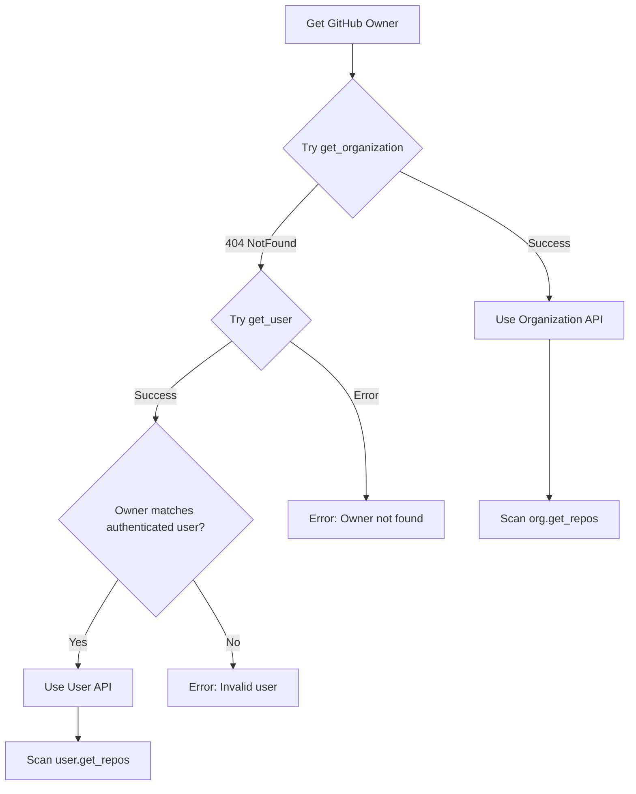
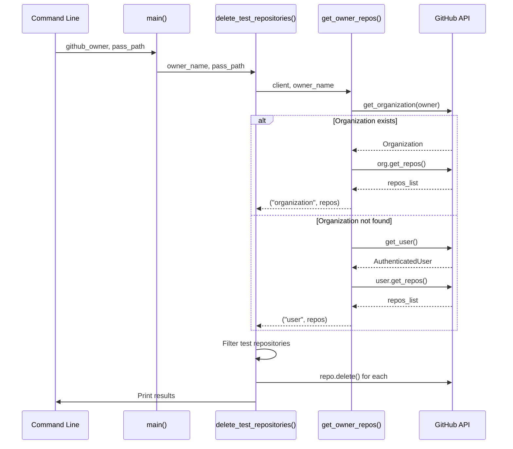

# Architecture Design - Owner for Cleanup Feature

## Overview

This feature transforms `delete_test_repos.py` from a hardcoded script that only works with the "abuflow" organization into a flexible CLI tool that can clean up test repositories from any GitHub owner (organization or user).

## Architectural Decisions

### 1. Command Line Interface Design

**Current:**
```bash
uv run delete_test_repos [pass_path]
```

**New:**
```bash
uv run delete_test_repos <github_owner> <pass_path>
```

**Rationale:**
- `github_owner` is essential data → required positional argument
- `pass_path` remains required positional argument (maintains current behavior)
- Both arguments are essential for the script's operation

### 2. Owner Detection Strategy

**Pattern:** Reuse the proven approach from `github_utils.py:create_repo()`



**Benefits:**
- Proven pattern already working in codebase
- Handles both organization and user repositories
- Proper error handling and validation
- Consistent with GitHub API best practices

### 3. Code Structure Refactoring

**Current Structure:**
- `delete_test_repositories()` function contains all logic
- Direct organization API calls hardcoded

**New Structure:**
```python
def get_owner_repos(client: Github, owner_name: str) -> tuple[str, list[Repository]]:
    """Get repositories for owner, returning (owner_type, repos_list)"""
    # Implement organization vs user detection logic
    
def delete_test_repositories(owner_name: str, pass_path: str | None = None) -> None:
    """Main deletion logic using parameterized owner"""
    # Use get_owner_repos() instead of hardcoded org logic
```

**Rationale:**
- Separation of concerns: owner detection vs deletion logic  
- Testable components
- Reusable owner detection logic
- Clear return types indicating owner type for logging

### 4. Error Handling Strategy

**New Error Scenarios:**
1. Owner doesn't exist (neither org nor user)
2. Owner is user but doesn't match authenticated user
3. Authenticated user lacks permissions on organization

**Approach:**
```python
# Let errors fall through naturally - developers prefer stack traces
owner_type, repos = get_owner_repos(client, owner_name)
print(f"🔍 Scanning repositories for {owner_type} '{owner_name}'...")
```

**Benefits:**
- Natural Python exception behavior for developer audience
- Stack traces provide full context for debugging
- Simpler code without unnecessary error wrapping
- Consistent with "let it fail" philosophy for dev tools

### 5. Backwards Compatibility Impact

**Breaking Changes:**
- Required positional argument added (github_owner)
- Argument order changed (github_owner now comes first)

**Migration Path:**
- Update documentation and help text
- Consider this a minor version bump
- Existing scripts will need to add github_owner as first argument

## Implementation Architecture

### Module Dependencies
```
delete_test_repos.py
├── argparse (stdlib)
├── github (PyGithub)
├── .utils (existing)
└── .github_utils (potential - for shared owner detection)
```

### Function Decomposition

1. **`get_owner_repos(client, owner_name)`**
   - Input: GitHub client, owner name string
   - Output: tuple[owner_type, repos_list]  
   - Responsibility: Owner detection and repository fetching
   - Error handling: Let PyGithub exceptions propagate naturally

2. **`delete_test_repositories(owner_name, pass_path)`**
   - Input: owner name, optional token path
   - Output: None (prints results)
   - Responsibility: Orchestrate token fetching, repo scanning, deletion
   - Calls get_owner_repos() for owner-agnostic logic

3. **`main()`**
   - Input: Command line arguments
   - Output: None  
   - Responsibility: Argument parsing, error handling, calling main logic
   - Updated argparse configuration

### Data Flow


## Security Considerations

**No New Security Risks:**
- Same permission model as before (token with delete access required)
- Owner parameter doesn't introduce privilege escalation vectors
- User validation prevents operating on wrong user's repositories

**Maintained Security:**
- Token handling unchanged
- Repository filtering logic unchanged
- Deletion confirmation logic unchanged

## Performance Implications

**Minimal Impact:**
- Additional API call for owner detection (negligible overhead)
- Same repository scanning and deletion performance
- No change in rate limiting behavior

## Testing Strategy

**Test Coverage Areas:**
1. Organization owner (existing functionality)
2. User owner (matching authenticated user) 
3. Invalid owner (neither org nor user)
4. User owner mismatch (security validation)
5. Argument parsing validation
6. Error message accuracy